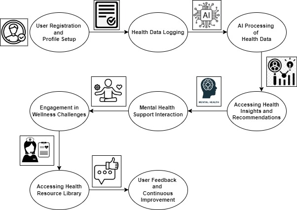

# FemWell
FemWell is an AI-powered mobile app that supports women’s health and wellness by providing personalized insights, reproductive health tracking, mental health resources, and a wellness community. Designed with privacy, inclusivity, and transparency in mind, it offers a holistic approach to women’s health.

## Introduction
**FemWell** is an AI-powered mobile application designed to address the unique healthcare challenges faced by women. By offering personalized health insights, reproductive health tracking, mental health support, and wellness resources, this app empowers women to make informed health decisions and improve their overall well-being.

## The Challenge
Women often encounter unmet healthcare needs due to a lack of personalized and accessible resources. Our app aims to bridge this gap by providing comprehensive health management powered by AI. By addressing reproductive health issues such as PCOS, endometriosis, and infertility, we strive to enhance women's educational and career opportunities, ensure safer pregnancies, and empower women through informed family planning.

## Vision
Imagine an AI-powered companion that understands and anticipates your health needs, guiding you through your wellness journey. Our vision is to provide every woman with access to comprehensive, personalized reproductive healthcare, enabling healthier and more fulfilling lives. We leverage cutting-edge technology to increase healthcare accessibility and foster supportive communities.

## Features

1. **Personalized Health Insights**
   - **AI-Driven Analysis:** Bespoke health recommendations based on activity levels, sleep patterns, nutrition logs, menstrual cycle information, and reported symptoms.
   - **Predictive Power:** Machine learning identifies unique patterns to offer predictive insights.

2. **Intelligent Reproductive Health Tracking**
   - **Adaptive Algorithms:** Precise menstrual cycle and fertility predictions.
   - **Holistic View:** Comprehensive reproductive health insights, including pregnancy guidance.

3. **Advanced Symptom Analysis**
   - **NLP for Health:** Natural Language Processing interprets symptoms, suggesting possible causes and actions.
   - **Risk Assessment:** Personalized alerts for conditions like osteoporosis and cardiovascular diseases.

4. **Mental Health Support**
   - **Interactive Chatbots:** AI-powered chatbots provide immediate support and professional help.
   - **Sentiment Tracking:** Analyzes mood logs to detect mental health patterns.

5. **Tailored Nutritional and Fitness Guidance**
   - **Personalization:** Nutrition and fitness plans based on health goals and data analysis.
   - **Visual Assistance:** Computer vision analyzes meal photos for nutritional breakdowns.

6. **Curated Health Resources**
   - **Smart Recommendations:** Relevant articles, videos, and podcasts.
   - **Dynamic Content:** Personalized health resource library.

7. **Community Insights and Engagement**
   - **Data-Driven Trends:** Analyzes anonymized community data for health trends.
   - **Supportive Environment:** Safe space for women to share experiences and advice.

8. **Natural Language Interface**
   - **Conversational AI:** Voice or text interface for health-related inquiries.
   - **User Empowerment:** Natural interaction enhances engagement.

9. **Proactive Health Monitoring**
   - **Anomaly Detection:** Monitors data for unusual patterns, prompting medical advice.
   - **Smart Reminders:** Schedules medication and appointment reminders.

## Data Flow Diagram

## UI/UX Excellence
We prioritize an intuitive, user-friendly interface that includes:
- Personalized Dashboard
- Customizable Profile and Settings
- Reproductive Health Tracker
- Mental Health Tools
- Wellness Challenges
- Resource Library
- AI Health Insights
- Community Features

## Ethical and Sustainable Foundations
1. **Data Privacy and Security:** Encrypted user data with transparent privacy policies.
2. **Inclusivity:** Designed for diverse backgrounds and health needs.
3. **Transparency in AI:** Clear communication of AI recommendations.
4. **Energy Efficiency:** Optimized for low battery and data usage.
5. **Eco-Friendly Practices:** Promotes sustainable health practices.

## Scalability and Impact
1. **Global Adaptability:** Supports multiple languages and regional health concerns.
2. **Collaborative Integration:** Partners with local health services and providers.
3. **Modular Design:** Easy feature additions and scalability.
4. **Public Health Insights:** Community data informs public health initiatives.

## Innovative Edge
1. **Holistic Health Management**
2. **Community Engagement**
3. **Dynamic AI Personalization**
4. **Interactive Features**
5. **AI-Driven Education**

## Achievement
We are thrilled to share that **FemWell** has been recognized as one of the top 5 teams in the prestigious **World Wide Women Hackathon**, organized by the **Shooting Star Foundation**. This accolade highlights our innovative approach to addressing women's health and wellness challenges through AI-powered solutions. 
              Our team’s commitment to creating a comprehensive, user-centric health platform was showcased and appreciated on a global stage. Being selected as a top finalist underscores the impact and relevance of **FemWell** in revolutionizing healthcare for women and amplifying their voices in the tech community. We extend our heartfelt gratitude to the Shooting Star Foundation and look forward to continuing our mission of empowering women through technology.

## Conclusion
**FemWell** is a groundbreaking tool designed to improve women's health outcomes and quality of life. By leveraging AI for adaptive predictions, symptom analysis, and personalized recommendations, the app sets a new standard for personalized healthcare, prioritizing sustainability and ethics.

